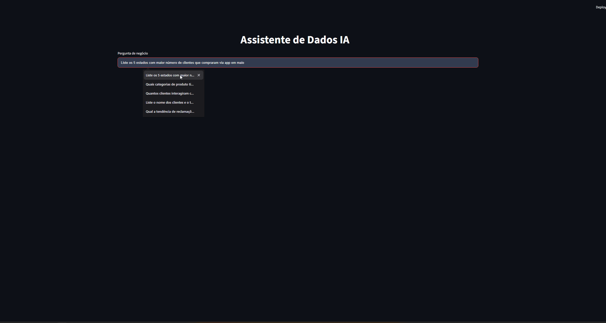

# 🤖 Assistente Virtual de Dados

## 📌 Sobre o Projeto

Este projeto implementa um **Assistente Virtual de Dados inteligente**, capaz de interpretar perguntas em linguagem natural e gerar automaticamente consultas SQL para responder perguntas de negócio.

## Demonstração



> O GIF mostra o fluxo completo do assistente de dados: o usuário faz uma pergunta em linguagem natural, o sistema gera e executa a SQL correspondente, corrige erros automaticamente se necessário, e apresenta a resposta em tabela ou gráfico.

A solução atua como um **analista de dados júnior**, sendo capaz de:

- Entender perguntas abertas
- Explorar o banco de dados dinamicamente (sem queries fixas)
- Corrigir erros automaticamente
- Apresentar respostas em formato adequado (tabela, gráfico ou valor único)
- Mostrar transparência sobre o raciocínio (plano de análise, SQL executada, explicação)

---

## 🎯 Objetivo do Desafio

Criar um sistema capaz de:

- Traduzir linguagem natural → SQL
- Consultar um banco SQLite
- Lidar com erros de execução
- Exibir visualizações adequadas
- Mostrar como chegou à resposta

---

## 🧠 Arquitetura da Solução

A solução foi construída utilizando um fluxo baseado em **agentes com LangGraph**, dividido em etapas:

### 🔁 Fluxo do agente

1. **Entrada do usuário** → Pergunta em linguagem natural.
2. **Planejar** → Quebra a pergunta em passos de análise.
3. **Gerar SQL** → Cria a query baseada no schema dinâmico.
4. **Validação** → Se a query falhar ou não retornar dados, o sistema identifica o erro.
5. **Correção automática** → O modelo ajusta a query com base no erro e tenta novamente.
6. **Resposta final** → Retorna SQL, resultado e visualização adequada.

---

## ⚙️ Tecnologias Utilizadas

- Python
- SQLite
- Streamlit
- LangGraph
- LLM (Groq)

---

## 🚀 Como Executar

### 1. Clonar o repositório

```bash
git clone https://github.com/Viviane-Silva/desafio-ai-engineer
cd desafio-ai-engineer
```

### 2. Criar ambiente virtual

```
python -m venv venv
source venv/bin/activate  # Linux/Mac
venv\Scripts\activate     # Windows
```

### 3. Instalar dependências

```
pip install -r requirements.txt
```

### 4. Configurar variáveis de ambiente

```
GROQ_API_KEY=your_key_here
GROQ_MODEL=openai/gpt-oss-120b

### 5. Rodar aplicação

```

streamlit run app.py

```

## 💬 Exemplos de Perguntas

- "Liste os 5 estados com maior número de clientes que compraram via app em maio"
- "Quantos clientes interagiram com campanhas de WhatsApp em 2024?"
- "Qual o número de reclamações não resolvidas por canal?"
- "Qual a tendência de reclamações por canal no último ano?"

## 🔮 Melhorias Recentes
- Pré-processamento de DataFrames para gráficos (linha, barra, pizza) dentro de graph.py.
- Evita erros em Streamlit causados por colunas com tipos mistos (texto + números).
- App mais limpo: lógica de preparação de dados para gráficos removida do app.py.
- Garantia de fallback: se não houver dados numéricos, mostra tabela em vez de quebrar.


## ✅ Testes e Validação
O sistema foi validado com perguntas de negócio reais, verificando:
   - SQL gerada continua válida e executável.
   - Erros ainda são identificados e corrigidos automaticamente.
   - Resposta final coerente com os dados.
   - Visualização escolhida é adequada e segura, sem quebrar por tipos mistos.
```
